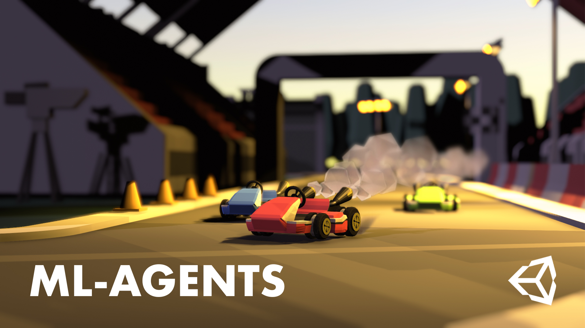

# AI Racing Karts

This is a fork of the main branch of the following repository by Sebastian Schuchmann: https://github.com/Sebastian-Schuchmann/AI-Racing-Karts

I followed his tutorial to train the agents and added some polish to the visuals.

### An ML-Agents Tutorial

ML-Agents Release 9 (Version 1.5.0 in Package Manager) with Unity 2019.4.14f

## Credits

- Thanks to Kenny (kenney.nl) for the sick 3D Models
- Thanks to Mix and Jam for much of the driving logic and kart model. Check out his Youtube!

